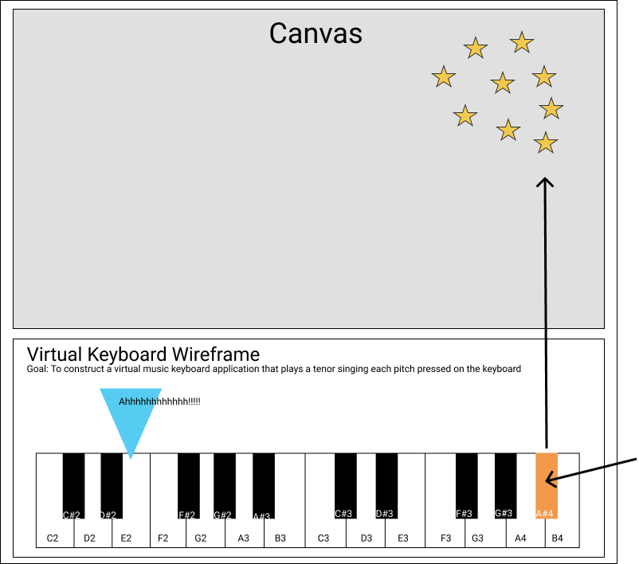
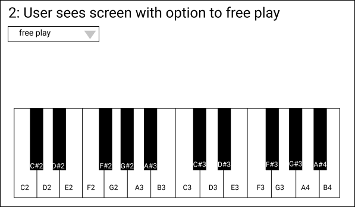
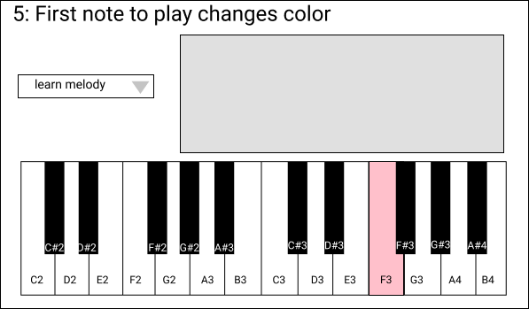
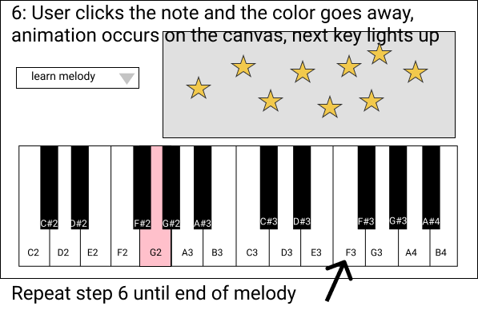

# Melodius - A virtual piano keyboard application
 
 

## _Author Names: Brittany Lindgren and Thomas Glenn_

### Project’s Purpose or Goal: 
To allow users to free play on the keyboard to hear notes and create animations using the Sketch.io API and to help users learn melodies on an interactive virtual keyboard.
 
 

### Wireframe
| User Story | Image |
|----------- | ----- |
|  As a user I want to agree to continue to the application and see the instructions so that I know how to interact with the application  |    |
|  As a user I want to be able to play any note on the keyboard   |         |
|  As a user, when I play a note on the keyboard, I want to hear the corresponding sound and see animations occur on the screen   |         |
|  As a user I want to be able to switch between `free play` mode and `learn melody` mode  |      |
|  As a user I want to see an indication of which key is first in the melody so that I know how to begin playing the song  |         |
|  As a user, when I play the indicated key, I want to hear the corresponding note and see the word or syllable at that stage in the song represented on the canvas. I want to see an indication of which note is next in the melody, so that I know how to continue playing the song  |    .      |
|  As a user, I want to receive an indication when I have finished playing the song  |        |

- As a user, I want to be able to return to either `free play` or `learn melody` mode / pages
- As a user, I want to know if I've made a mistake      
 
 

## Tools, frameworks, libraries, APIs, modules and/or other resources to create this project:

* [MIDI.js](https://github.com/mudcube/MIDI.js/)
* Sketch.io API
* JavaScript
* Webpack
* npm
* Visual Studio Code
* Git, GitHub, GitHub Projects
* Figma
* Unsplash - credit photographer if use piano background
Photo by <a href="https://unsplash.com/@ebuenclemente205?utm_source=unsplash&amp;utm_medium=referral&amp;utm_content=creditCopyText">Ebuen Clemente Jr</a> on <a href="https://unsplash.com/s/photos/piano?utm_source=unsplash&amp;utm_medium=referral&amp;utm_content=creditCopyText">Unsplash</a>
 
 

## Known Bugs
| What do I expect |  What is happening  | Error Message |  Resolved | How was the issue resolved  |
| ------- | ----- | ------ | ------- | ------- |
|  note  |  note  |  message  |  Y, N or in progress  |  note  |
 
 

### ToDos
[npm docs](https://docs.npmjs.com/cli/v6/configuring-npm/package-json)

1. Need to add SPDX license identifier to package.json "license"?
e.g. `{ "license" : "MITNFA" }`
https://spdx.org/licenses/MITNFA.html

  or signal that we do not wish to grant others the right to use a private or unpublished package with `{ "license": "UNLICENSED" }` and `"private": true` (for Sketch?)

2. Add a `files` field to package.json to describe which entries to be included when package is installed as dependency?

3. Other keys that we may need / want in our package.json?
- browser
- bin
- directories
- config 
`{ "name" : "foo", "config" : { "port" : "8080" } }`

- note in npm docs - `Please do not put test harnesses or transpilers in your dependencies object.`

- if we add more than one .js file, look at webpack docs Output Management and Development chapters for setup